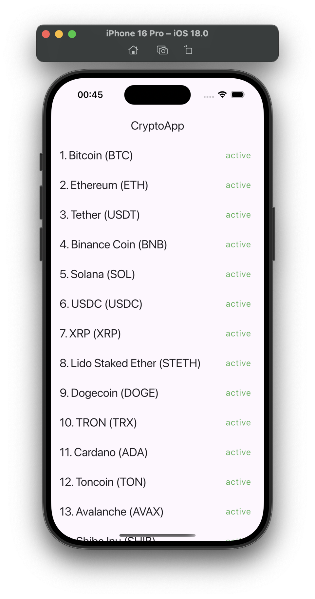
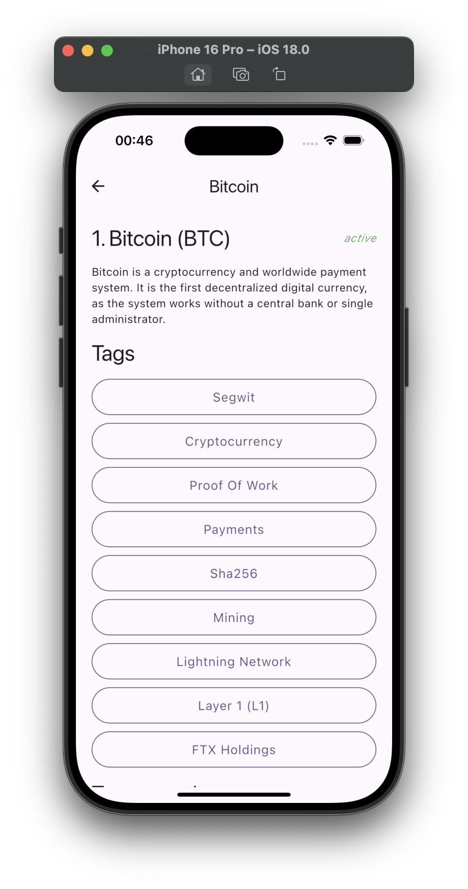

# CryptoApp.Flutter

CryptoApp.Flutter is a mobile application built with Flutter that allows users to browse and view cryptocurrency information. The app fetches real-time data from the CoinPaprika API to display the latest information about various cryptocurrencies.

## Features

- Displays a list of cryptocurrencies with relevant information like price, rank, and market cap.
- Detailed view of each cryptocurrency, including historical data, charts, and descriptions.
- Integration with CoinPaprika API for real-time data updates.
- Supports MacOs, Android and iOS platforms.

## Technology Used

- **Flutter**: A powerful framework for building cross-platform mobile apps.
- **Dart**: The language used to build the Flutter app.
- **Provider**: State management solution used for managing app state.
- **CoinPaprika API**: Provides real-time cryptocurrency data for the app.

## Screenshots

Here are some screenshots of the app:

| Main Screen                       | Details Screen                   |
|------------------------------------|-----------------------------------|
|  |  |

## How It Works

The app fetches data from the CoinPaprika API using HTTP requests. It uses the Provider package to manage the state and display the fetched data in the UI. The app allows users to browse a list of cryptocurrencies and view more details by selecting any coin from the list.

### Data Flow

1. The app sends a request to the CoinPaprika API for a list of cryptocurrencies.
2. The API returns the data, which is then parsed and stored in the app's state.
3. Users can tap on any coin to view additional details, including market trends, price changes, and other information.

## Contributing

Contributions are welcome! If you want to contribute to this project, feel free to fork the repository and submit a pull request.

## License

This project is licensed under the MIT License. See the [LICENSE](/LICENSE) file for more details.
